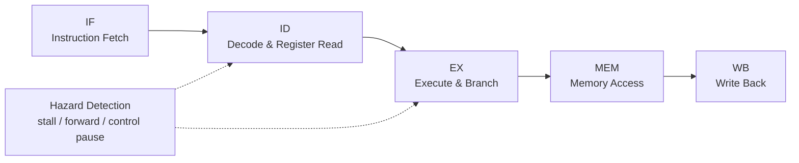

# 哈工大深圳（HITSZ）MiniRV Pipelined CPU

<p align="center">
  
  
  
  
</p>

哈尔滨工业大学（深圳）计算机设计与实践课程项目：一个面向 miniRV 指令集的 Verilog CPU 实现。项目从单周期 CPU 扩展到五级流水线结构，覆盖取指、译码、执行、访存和写回，并处理数据冒险与控制冒险。

## Project Snapshot

| 维度 | 内容 |
| --- | --- |
| 项目类型 | 计算机组成 / CPU 设计课程项目 |
| HDL | Verilog |
| ISA | miniRV / RISC-V style instructions |
| 架构 | 单周期 CPU + 五级流水线 CPU |
| 目标 | 在课程实验环境中实现可运行、可扩展、可解释的 CPU 数据通路与控制逻辑 |

## Highlights

- 支持 37 条 miniRV / RISC-V 风格指令，在基础要求的 24 条指令上额外扩展 13 条。
- 实现单周期 CPU 与五级流水线 CPU，单周期频率约 50MHz，流水线频率约 100MHz。
- 使用前递与停顿处理数据冒险。
- 使用流水线暂停处理控制冒险。
- 包含 SoC 顶层、寄存器堆、ALU、控制器、存储器接口、数码管和 LED / Switch 外设驱动。

## Pipeline Overview



项目通过流水线寄存器分隔阶段，并在相关指令之间加入前递、停顿和控制暂停逻辑，使处理器能够在课程实验环境中稳定运行。

## Instruction Coverage

```text
add, sub, and, or, xor,
sll, srl, sra, slt, sltu,
addi, andi, ori, xori,
slli, srli, srai, slti, sltiu,
lb, lbu, lh, lhu, lw,
sb, sh, sw,
beq, bne, blt, bltu, bge, bgeu,
lui, auipc, jal, jalr
```

## Core Modules

| 模块 | 作用 |
| --- | --- |
| `miniRV_SoC.v` | SoC 顶层连接 CPU、存储器与外设 |
| `myCPU.v` | CPU 主体结构 |
| `PC.v` / `NPC.v` | 程序计数器与下一条 PC 计算 |
| `Control.v` | 指令译码与控制信号生成 |
| `RegFile.v` | 通用寄存器堆 |
| `ALU.v` | 算术逻辑单元 |
| `IF_ID.v` / `ID_EX.v` / `EX_MEM.v` / `MEM_WB.v` | 五级流水线寄存器 |
| `Hazard_Detection.v` | 冒险检测、暂停与前递控制 |
| `MEM.v` | 存储器访问 |
| `Bridge.v` | 存储器与外设地址桥 |
| `DigitDriver.v` / `LEDDriver.v` / `SwitchDriver.v` | 板级外设驱动 |

## Repository Layout

```text
.
├── ALU.v
├── Control.v
├── Hazard_Detection.v
├── IF_ID.v / ID_EX.v / EX_MEM.v / MEM_WB.v
├── MEM.v
├── RegFile.v
├── miniRV_SoC.v
├── myCPU.v
├── defines.vh
└── README.md
```

## What I Learned

- 如何把指令格式、立即数扩展、寄存器读写、ALU 控制和访存逻辑串成完整数据通路。
- 如何在流水线中处理 load-use、数据相关和分支控制相关问题。
- 如何从单周期设计过渡到流水线设计，并用模块边界降低调试复杂度。
- 如何让课程实验代码更接近可复盘的工程材料：模块清楚、说明完整、关键设计点可追踪。

## Author

我来自哈工大深圳计算机学院，是一名大三本科生，主要关注计算机系统、体系结构、软件工程和 AI 应用方向。这个仓库记录了我在计算机组成与 CPU 设计实践中的一次完整实现。

如果这个项目对你有帮助，欢迎给一个 Star。
